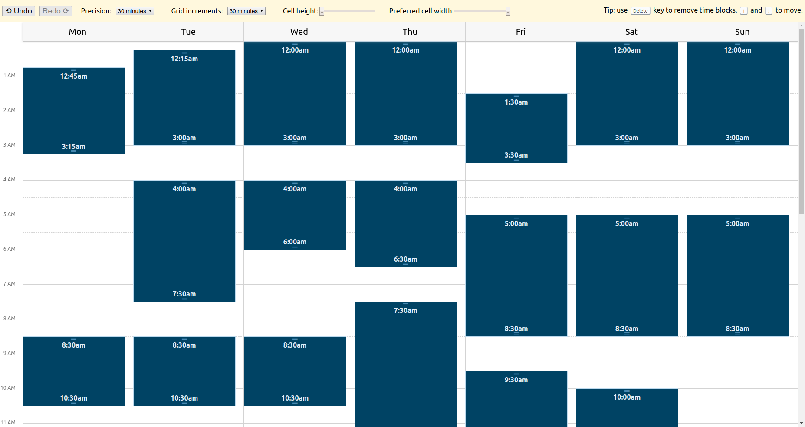

# `@remotelock/react-week-scheduler`

 



[Demo](https://remotelock.github.io/react-week-scheduler/)

[](https://codesandbox.io/s/mmj3xzk4x?fontsize=14)

## Installation

```
yarn add @remotelock/react-week-scheduler
```

## Basic Usage

```jsx
import React, { useState } from 'react';
import 'resize-observer-polyfill/dist/ResizeObserver.global';
import { TimeGridScheduler } from '@remotelock/react-week-scheduler';
import classNames from '@remotelock/react-week-scheduler/index.css';

const rangeStrings = [
  ['2019-03-03T22:45:00.000Z', '2019-03-04T01:15:00.000Z'],
  ['2019-03-04T22:15:00.000Z', '2019-03-05T01:00:00.000Z'],
  ['2019-03-05T22:00:00.000Z', '2019-03-06T01:00:00.000Z'],
  ['2019-03-06T22:00:00.000Z', '2019-03-07T01:00:00.000Z'],
  ['2019-03-07T05:30:00.000Z', '2019-03-07T10:00:00.000Z'],
  ['2019-03-08T22:00:00.000Z', '2019-03-09T01:00:00.000Z'],
  ['2019-03-09T22:00:00.000Z', '2019-03-10T01:00:00.000Z'],
];

const defaultSchedule = rangeStrings.map(range =>
  range.map(dateString => new Date(dateString)),
);

function App() {
  const [schedule, setSchedule] = useState(defaultSchedule);

  return (
    <TimeGridScheduler
      classes={classNames}
      originDate={new Date('2019-03-04')}
      schedule={schedule}
      onChange={setSchedule}
    />
  );
}
```

## Customization

`react-week-scheduler` ships with a set of default styles for convenience. The styles are expected to be compiled as [CSS Modules](https://github.com/css-modules/css-modules) class names. The components exported from the package do not import the styles by default. Instead, they expect a `classes` prop to be passed.

To use the default styles you need to have your bundler configured for CSS Modules. The class names need to be available at runtime as a regular JS object.

### Using the default styles

To use the default styles, import the default classes object and pass it to the component:

```jsx
import { TimeGridScheduler } from '@remotelock/react-week-scheduler';
import classNames from '@remotelock/react-week-scheduler/index.css';

function App() {
  return <TimeGridScheduler classes={classNames} {...otherProps} />;
}
```

## Browser Support

This library should work on any modern browser.

However, [a _global_ polyfill for `ResizeObserver`](https://www.npmjs.com/package/resize-observer-polyfill) is required since `ResizeObserver` is [currently only supported by Chrome 64+](https://caniuse.com/#feat=resizeobserver).

The following web platform features are used:

- Flexbox
- `touch-action: none`
- `position: sticky`
- Touch Events
- [CSS containement](https://developers.google.com/web/updates/2016/06/css-containment) (optional)
- Custom CSS Properties (optional)

### Mobile Browser Support

Touch events are handled properly, with a 300ms delay on the initial touch start event to allow for scrolling.

The component should work fine on any modern mobile browser. However, due to lack of support for `touch-action: none`
on iOS Safari, dragging or resizing time blocks may not work very well.
